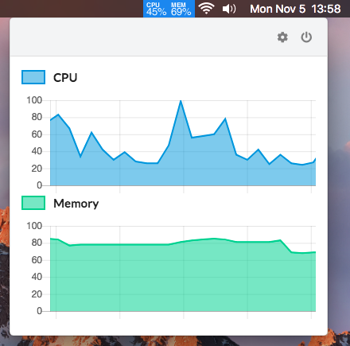
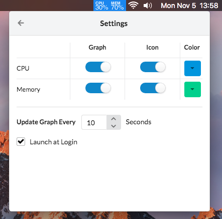

# macOS Activity Monitor

A free solutions to show information about your CPU and Memory usage right on your menu bar

## App Preview





## Download

You can download it from the [release](https://github.com/joelmora/macos-activity-monitor/releases) page


## Local Installation

You can clone this repository, modify it and build it yourself, first you need to install all dependencies with: 
```
$ yarn install
```

Then you can use all scripts available:
```
$ yarn [command]
```

### Commands available:

`electron-build`: Build the final app

`electron-start`: Start the electron app in dev mode

`create-icon`: Grab the .png icon and transform it into an .icns icon

`react-start`: Start the react app in dev mode

`react-build`: Build the react app

`react-test`: Run tests

`build-app"`: Build the react/electron app